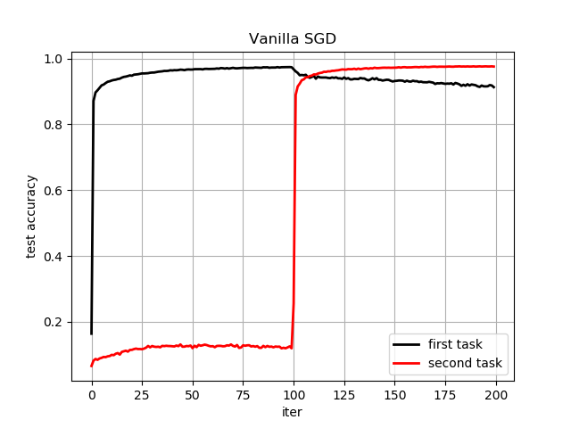
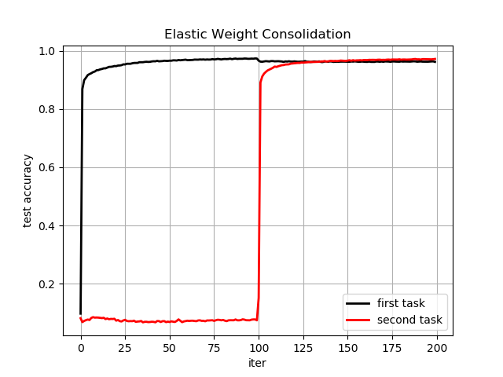

# Elastic Weight Consolidation 
Standard neural networks can't learn continually without forgetting previous tasks ('Catastrophic Forgetting').  
Here, I implemented a method called Elastic Weight Consolidation (EWC), originally proposed by Kirkpatrick et al (2017), that mitigates this problem.

## Example
Below a performance comparison between networks trained either with pure SGD or additionally with EWC, evaluated on two permuted MNIST tasks. 

 
<!--     
 -->


## How to run the code 
The code is modularised. Call run_ewc.py to train the network first on standard mnist and then on permuted mnist. A plot with learning curves for held-out data will be generated automatically. 
```bash
python run_ewc.py
```

You can specify the following settings in run_ewc.py:

```python
params['n_inputs'] = 784 # number of input nodes
params['n_classes'] = 10 # number of classes (digits 0 to 9)
params['n_hidden'] = 100 # number of hidden units
params['weight_init'] = 1e-2 # scale of the weight variance

params['n_iters'] = int(1e4) # number of training epochs

params['lrate'] = 1e-1 # learning rate
params['do_ewc'] = True # perform ewc (set to false to run vanilla sgd)
params['ewc_lambda'] = 15 # lambda hyperparameter for ewc loss
params['fim_samples'] = 500 # number of samples used to compute fisher information matrix
params['mbatch_size'] = 250 # minibatch size 

params['disp_n_steps'] = 100 # display progress every n steps
params['verbose'] = True # print some training data to stdout
params['task'] = 'permutedMNIST' # which continual learning problem to tackle. supports 'permutedMNIST' and 'splitMNIST'
params['device'] = 'CPU' # use CPU, or alternatively GPU if you have a fast video card that supports CUDA.

```

## How to embed the code in your project 
The code is modularised as follows:

```python
from ewc_lib.model import Nnet # contains neural network
from ewc_lib.trainer import train_nnet # contains training routines
from ewc_lib.visualise import disp_results # simple function to plot learning curves
```


## Requirements
This implementation is based on tensorflow 1.x. Feel free to contribute a port to tf2 if you fancy.
It's guaranteed to work with the following package versions:
```
tensorflow==1.15.0
matplotlib==3.1.3
numpy==1.18.1
scikit_learn==0.24.2
```


## Acknowledgements
Thanks to Ari Seff's implementation of EWC which clarified a few issues I faced when setting up the computational graph


